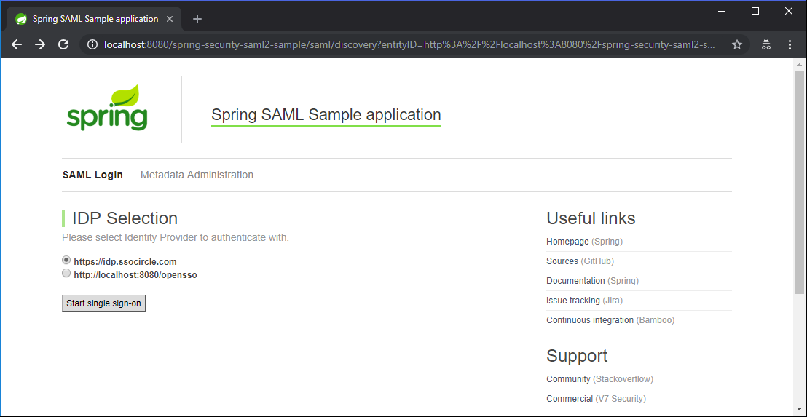
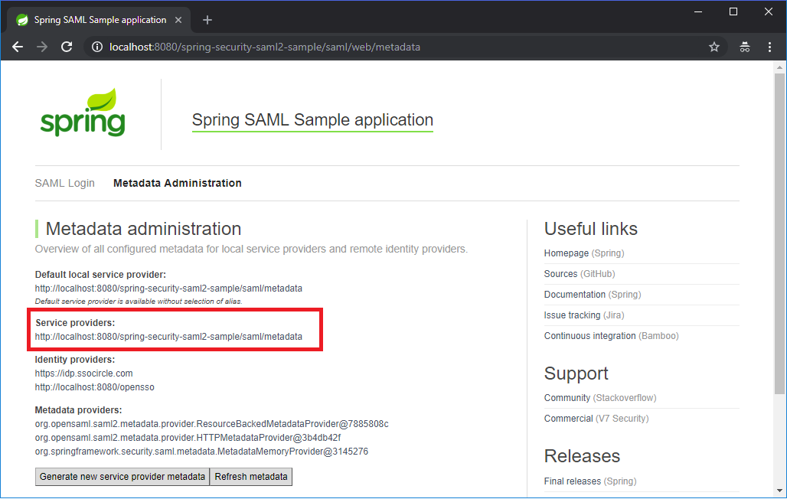
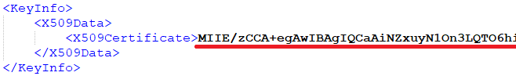
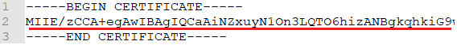
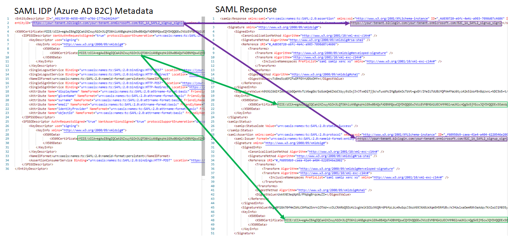
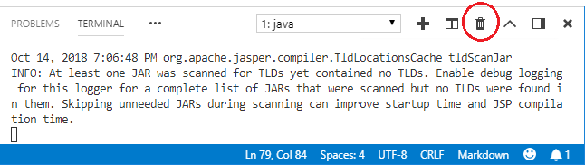

# Spring Security SAML Extension for Azure AD B2C

This solution demonstrates how to integrate Java-based application with Azure AD B2C, using SAML protocol. The solution is based on the [Spring Security SAML Extension](https://docs.spring.io/spring-security-saml/docs/1.0.x-SNAPSHOT/reference/htmlsingle/) project.

## 1) Download the sample application
Download the Spring SAML Extension either from the [releases](https://repo.spring.io/list/release/org/springframework/security/extensions/spring-security-saml/). The Spring SAML Sample application is included in **sample** directory. We will be customizing content of the sample application in the following steps.

##	2) Open you project in VS code
1. Open the sample folder with VS code
1. When using the release zip, compile the sample application available in the sample directory. From the VS code terminal run `mvn package`
1. You can start the application from the release sample directory. From the VS code terminal run: `mvn tomcat7:run`
1. After startup the Spring SAML sample application will be available at http://localhost:8080/spring-security-saml2-sample. Click on **Start single sign-on** and sign-in with https://idp.ssocircle.com account (or create a new one). 
    

## 3) Set the SP metadata to the IDP (Azure AD B2C)
In this step, you export the SP metadata, upload, and set the SP metadata in your relying party policy.
1. Download the metadata from http://localhost:8080/spring-security-saml2-sample/saml/metadata OR click on **Metadata Administration**. Sign-in with username: **admin**, and password **admin**. Click on the **Service Providers** metadata link, and copy the metadata.
    
1. You can set the SP metadata directly into your relying party policy. In this demo, you upload the SP metadata to Azure Blob Store (public) and copy the URL.
1. Open your relying party policy, and set the value of the `PartnerEntity` metadata to the URL of the metadata.
    ```XML
    <TechnicalProfile Id="PolicyProfile">
      <DisplayName>PolicyProfile</DisplayName>
      <Protocol Name="SAML2"/>
      <Metadata>
        <Item Key="PartnerEntity">https://your-account.blob.core.windows.net/azure-ad-b2c/spring_saml_metadata.xml</Item>
        ...
      </Metadata>
    ```
1. Upload your policy files

## 3) Set the IDP metadata to the SP
1. Try to read your Azure AD B2C (IDP) metadata. The URL or your Azure AD B2C SAML metadata is loacaed in the following URL: `https://your-tenant.b2clogin.com/your-tenant.onmicrosoft.com/policy-name/Samlp/metadata`, replace the tenant name and policy name with your tenant name and the relying party policy name. For example: `https://contoso.b2clogin.com/contoso.onmicrosoft.com/B2C_1A_SAML2_signup_signin/Samlp/metadata`

1. 	Open the file sample/src/main/webapp/WEB-INF/**securityContext.xml** file. Locate following element: 

```XML
<bean id="metadata" class="org.springframework.security.saml.metadata.CachingMetadataManager">
```

Under the `<bean class="org.opensaml.saml2.metadata.provider.HTTPMetadataProvider">` element set the Azure AD B2C metadata URL. For example:

```XML
<!-- IDP Metadata configuration - paths to metadata of IDPs in circle of trust is here -->
<bean id="metadata" class="org.springframework.security.saml.metadata.CachingMetadataManager">
    <constructor-arg>
        <list>
            <bean class="org.opensaml.saml2.metadata.provider.HTTPMetadataProvider">
                <constructor-arg>
                    <value type="java.lang.String">https://contoso.b2clogin.com/contoso.onmicrosoft.com/B2C_1A_SAML2_signup_signin/Samlp/metadata</value>
                </constructor-arg>
                <constructor-arg>
                    <value type="int">5000</value>
                </constructor-arg>
                <property name="parserPool" ref="parserPool"/>
            </bean>
        </list>
    </constructor-arg>
</bean>
```

## 4) Import Azure AD B2C public key
Cryptographic material used to decrypt incoming data and verify trust of signatures in SAML messages and metadata is stored either in metadata of remote entities or in the keyManager. Even though that Azure AD B2C metadata contains the public key of the certificate, it's required to add this public key as trusted certificate. In order to import additional trusted key to the keystore run, for example:

1. Copy your certificate file (public key) to **sample\src\main\resources\security** folder. If you don't have the .cer or .crt file, you can copy the public key from Azure AD B2C metadata. Open Azure AD B2C relying party metadata https://your-tenant.b2clogin.com/te/your-tenant.onmicrosoft.com/policy-name/Samlp/metadata. Replace the tenant name and policy name with your tenant name and the relying party policy name. 
    1. Create new file, for example, b2c.cer
    1. The certificate should start with following line:
    ```
    -----BEGIN CERTIFICATE-----
    ```
    1. Extract the content of the certificate into the b2c.cer file
    
    1. Add the closing like
    ```
    -----END CERTIFICATE-----
    ```

    You certificate file should look like this one:
    
1. In the terminal change, the directory to sample\src\main\resources\security
    ```
    CD src\main\resources\security
    ```
1. Run the import command
    ```
    keytool -importcert -alias azure-ad-b2c -file b2c.cer -keystore samlKeystore.jks
    ```
1. The password to the samlKeystore.jks is `nalle123`
1. Type `yes`, and click **enter**

Note: if the certificate exists you can remove by using following command
- **List** all certificate: `keytool -list -v -keystore samlKeystore.jks`
- **Delete** a certificate: `keytool -delete -alias b2c -keystore samlKeystore.jks`
- **Import**: `keytool -importcert -alias b2c -file b2c.cer -keystore samlKeystore.jks` 


## Debug your SP application
You can enable debug logging by modifying file sample/src/main/resources/log4j.properties and adding, or changing the value of:

```
log4j.logger.org.springframework.security.saml=DEBUG
log4j.logger.org.opensaml=DEBUG
log4j.logger.PROTOCOL_MESSAGE=DEBUG
```

## Common mistakes
Make sure the issuer and the public key of your certificate much the one that is specified in the IDP (Azure AD B2C) with the one specified in the SAML response.
. 

In your policy, make sure you sent the **Saml2AssertionIssuer** technical profile with a certificate trusted by the SP.

```XML
<CryptographicKeys>
  <Key Id="MetadataSigning" StorageReferenceId="B2C_1A_b2c_saml_key" />
  <Key Id="SamlAssertionSigning" StorageReferenceId="B2C_1A_b2c_saml_key" />
  <Key Id="SamlMessageSigning" StorageReferenceId="B2C_1A_b2c_saml_key" />
</CryptographicKeys>
```

When you change your code and need to run again, you may need to kill you terminal, open it again, and run the `mvn tomcat7:run` command.


## Disclaimer
The sample is developed and managed by the open-source community in GitHub. The application is not part of Azure AD B2C product and it's not supported under any Microsoft standard support program or service. The sample (Azure AD B2C policy and any companion code) is provided AS IS without warranty of any kind.

## License
Source code of the module is licensed under the Apache License, Version 2.0. You may obtain copy of the license at http://www.apache.org/licenses/LICENSE-2.0.